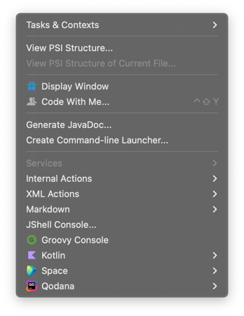
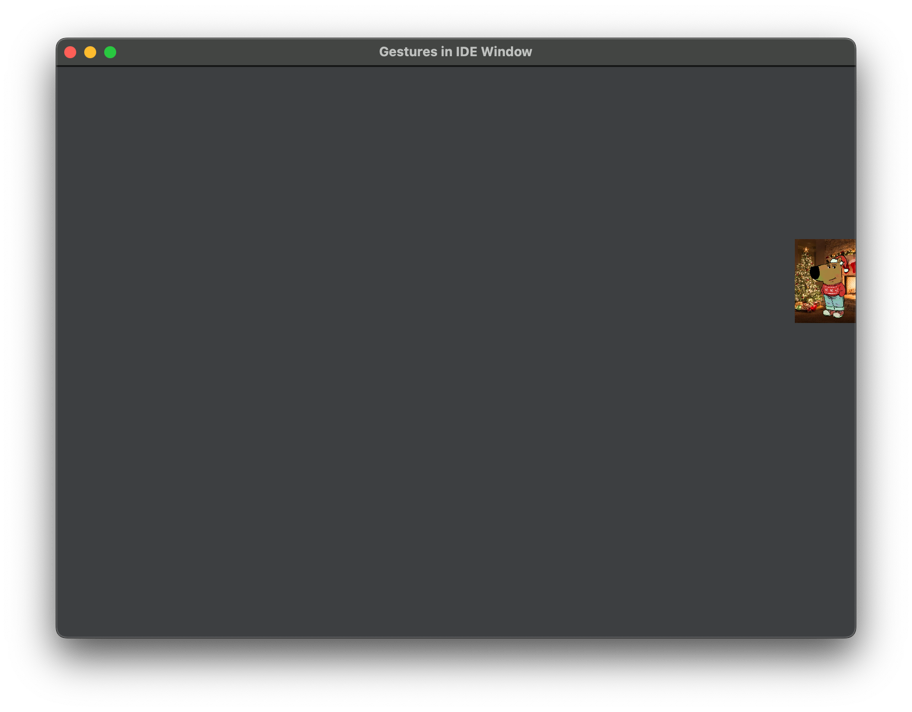
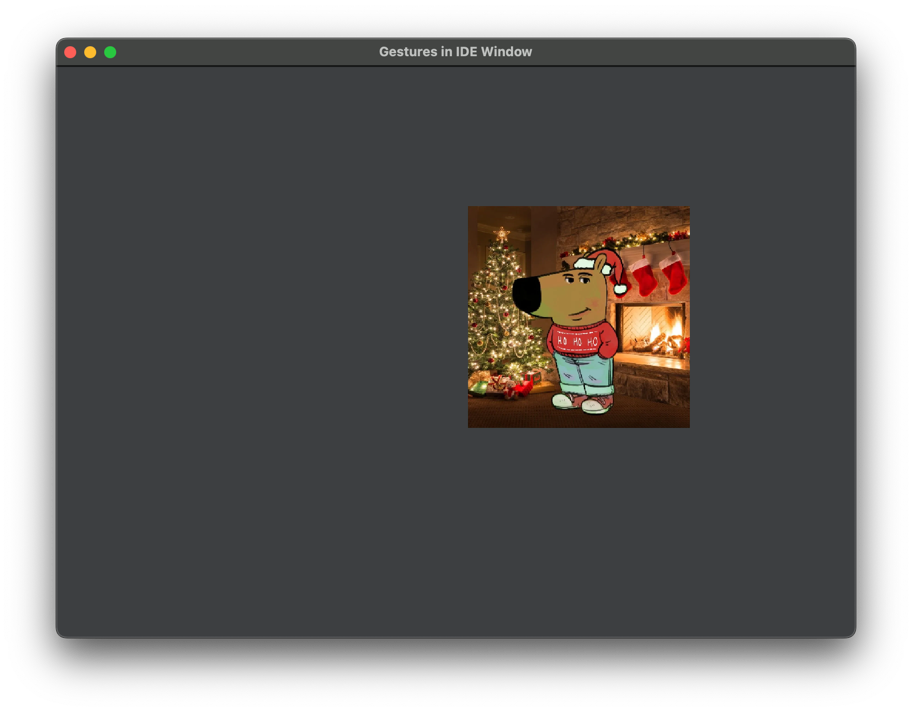
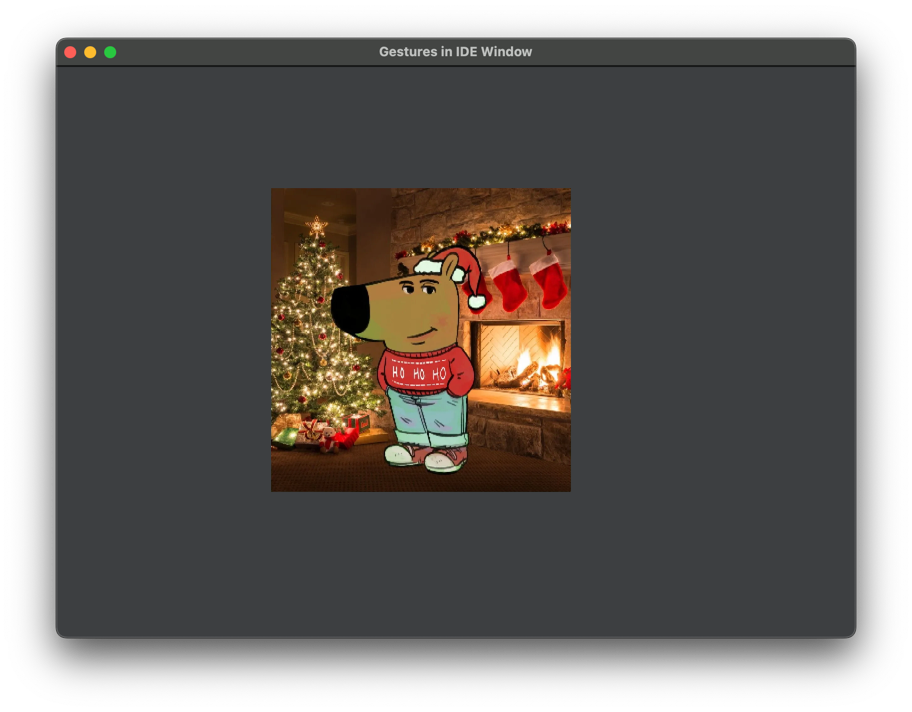

# Test Task for Gestures in IDE

## Introduction
<!-- Plugin description -->
This is a plugin for JetBrains IDEs that allows you to "play" with a meme or other complex object on a frame within the IDE.
<!-- Plugin description end -->

## Basic Plugin Guide
### How to install and run?

1. Clone the repository from [github](https://github.com/marinamadaras/gestures-in-ide)
2. Open the project in IntelliJ IDEA
3. Run the task "Run Plugin" in the Gradle tool window
4. Open any project within the simulated IDE
5. Search for the "Tools" menu
6. Select the "Display Window" option

### How to interact with the window?

When the window is opened, when your cursor is outside it, you will just see an empty window. When you move the cursor
inside the window from an arbitrary side, a meme will appear where your cursor is as a smaller size. The meme will be resized
based on a few rules, and they will be exemplified here for one side, but it holds for all sides.

If you enter the window with your cursor from the right side, the meme will be small. 
- When you move your cursor
to the left (so horizontally, in the direction of entering the window),
the image will begin to grow in size, until it caps at its original size.

- After the cap, 
any further move of the cursor to the left, will just move the meme, not resize it. 
- If you move the cursor back to the right, the meme will start shrinking, until it reaches its minimal size again.
- If you move the cursor up or down, the meme will just be moved to the cursor position, it will not change its size.

Upon placing the cursor outside the window, the meme will disappear and the previous entry side will be reset.

## "Advanced" features
In the [configuration file](src/main/resources/application.properties) you can edit some of the properties to enable 
advanced features.
### Scaling speed
The scaling of the meme is done dynamically, using the changes in cursor positions, but also
using a scaling speed factor.
Currently, the scaling speed is set to **0.7**, to make it feel natural, but it can be lowered or increased to 
your preference by changing the **_speed_factor_** from the [configuration file](src/main/resources/application.properties).

### Changing meme to a complex pane.
For the advanced feature from the test task description, I was asked to try replicating the behavior of a complex UI element
that takes a long time to render. For this I decided to mimic a background task happening when the complex component is 
created, that shows a progress bar manually created by increasing the progress amount every couple milliseconds, and 
upon the completion of the background task show a panel that implies the existence of a more complex component. 

Of course, this is just a proof of concept for an actually complex component, where we would need to infer the progress
of the way its loaded, but this just goes to show the "seamless" switch of panels for the user.

To interact with this component, instead of the meme, you can set the boolean **_show_complex_component_** to true in the 
[configuration file](src/main/resources/application.properties).

Important note!!! Start interacting with the opened window as soon as it appears on screen, as the loading
of the "complex" component starts as soon as the window is opened.

## Technologies used
1. Kotlin
2. Swing
3. JUnit
4. AssertJ
5. Mockito
6. Gradle

---
Plugin based on the [IntelliJ Platform Plugin Template][template].

[template]: https://github.com/JetBrains/intellij-platform-plugin-template
[docs:plugin-description]: https://plugins.jetbrains.com/docs/intellij/plugin-user-experience.html#plugin-description-and-presentation
